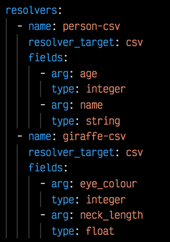
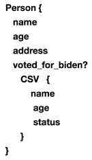

# Hasura-csv

### What is hasura-csv?

One of the many ways to use Hasura is to allow power users to interact with an API through Hasura instead of a website designed primarily for visualising data. One often requested feature that was particularly useful for my team was the ability to download CSV data which a site might normally provide a browser interface for.

This service will spin up a remote GraphQL schema from a yaml file which will allow the quick creation of custom field/s that can forward the results from a Hasura resolver to the hasura-csv service, where it will be written to the output folder as a csv file.

#### How do i use it?

Lets say that I have a Person resolver in my Hasura schema which looks like this

But im not interested in whether this person actually voted for Biden, or their real address as I only want their names and ages.

First of all I create the following hcsvconfig.yaml (copy the example.hcsvconfig.yaml for a quick leg up). 

I need to create a target resolver in my yaml which Hasura will connect to. 

**!!!This must be a different name from the actual resolver we want to output from!!!** 

(i use person_csv here for the Person resolver).

Here i've also added a seperate link for the giraffe resolver 🦒 add as many fields and resolver links as you like. Each remote resolver will correspond to one Hasura resolver.

**npm install** and run the service with **npm run start**.

- Go to your Hasura console and select **REMOTE SCHEMAS**. 
- Enter the url of hasura-csv (by default this will be http://localhost:5000/graphql)
- Name your remote schema (i generally use 'CSV')
- Select the resolver you wish to output in the **DATA** tab and select **relationships** and **Add a remote schema relationship**

Now name the field which you will want to use in the Person resolver to indicate you want to also send the output of the resolver to hasura-csvs person-csv, i use CSV (this can be the same for every table if you want)   

Now to output to hasura-csv simply add the CSV field to the resolver you have linked it to in a UI query, for example:

*The subfields will only affect the display in Hasura, the linked fields only will be transmitted, status is the optional 'OK' response from the service.*

The output will be written to './output/person_csv_{{timestamp}}'

#### Setting up the API:   
 

>cp ./etc/.example-env ./etc/.env   
>cp ./example.hcsvconfig.yaml ./hcsvconfig.yaml

Then set secrets and paths in .env, and setup your yaml configuration before running.   

#### TBD:
  

- Typescript is not yet doing much. 

- I have only tested this on a couple of thousand rows, please feel free to PR :pray:
 

#### Script commands:

**npm start**
**npm run build** build only   
**npm run prettier** prettier code formatting   
**npm run lint** run linter   
**npm run lint-ts** run linter on typescript   
