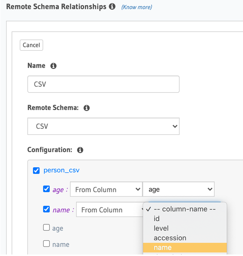

# Hasura-csv

#### Setting up the API:

>cd ./etc/.example-env ./etc/.env   

then set secrets and paths in .env before running.   

#### How to use:
hasura-csv will allow the linking of predefined resolver fields which exist in the hasura db (visible through the hasura UI).

First identify a resolver and the fields you wish to be CSV columns, then go to the remote schemas section and add a new remote schema.

give the uri of hasura-csv (by default this would be http://localhost:5000/graphql)

Once the schema has been added it will be available to link to in the Data section.

Lets say we want to export the fields 'name' and 'address' from the person resolver:

First copy the example file example.hcsvconfig.yaml to hcsvconfig.yaml and edit the ./hcsvconfig.yaml file in the hasura-csv root. Create a resolver entry for each resolver you want to add a hasura-csv writer link to. Create an arg entry named after each column you wish to pull from the relevant hasura resolver and it's type (float, integer, string, or id)

run the service with **npm run start**

Go back to hasura, to Data and select the person resolver in the left hand column, then select relationships / remote schema relationships / Add a remote schema relationship. 

Name the field you will use to insert the hasura-csv link (CSV is a good idea!), select your remote schema which will be the details you just defined in the yaml file. Then select the mapping you want to map to (we would select person as we entered it as our mapping in the yaml file), now select the args you set up which will link the columns to the service via GraphQL args.

To output the results of a query just create your query as you would normally, lets say we create a person query here. In the top level of the resolver add the CSV field you just created. The filtered results of the query will be exported via the columns you just selected in the remote schema relationships.

#### TBD:
At the moment I haven't yet added streaming which means this will only work for 1000 odd rows, I will do this when i get a minute or feel free to submit a PR!

#### Script commands:

**npm start**   
**npm test** run tests   
**npm run build** build only   
**npm run test-watch** run tests with nodemon hot reloading   
**npm run prettier** prettier code formatting   
**npm run lint** run linter   
**npm run lint-ts** run linter on typescript   
